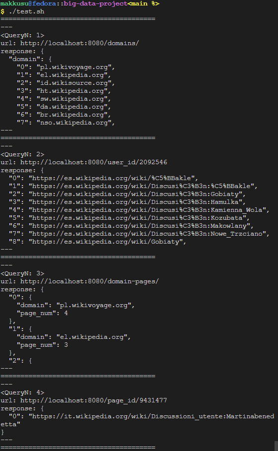
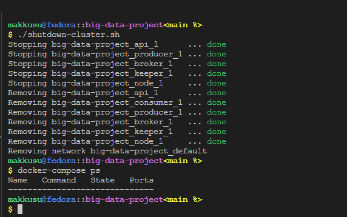

# Lab VIII: Cassandra and Kafka

### Requirements
- `bash`
- `docker`
- `docker-compose`
- `jq` -- for beatiful json output 

### Setup
-   ```bash
    git clone https://github.com/mak9su4roi/big-data-projec/
    ```
-   ```bash
    chmod -R +x ./big-data-project/
    ```
-   ```bash
    cd ./big-data-project/
    ```

### What has been done...
-   Reading stream from Wiki
-   Filtering and passing steam to Kafka
-   Reading stream from Kafka and writing into Cassandra tables
-   Implementing API for B{1,2,3,4}


### Instructions
-   Create cassandra cluster & kafka cluster
    ```bash
    ./run-cassandra-cluster.sh
    ./run-kafka-cluster.sh
    ```
-   Run producer & consumer
    ```bash
    ./run-producer.sh
    ```
    ```bash
    ./run-consumer.sh
    ```
-   Wait for a while and launch api
    ```bash
    ./run-api.sh
    ```
-   Run testing scripts
    ```bash
    ./test.sh
    ```
-   

-   Shutdown whole cluster
    ```bash
    ./shutdown-cluster.sh
    docker-compose ps
    ```
-   
